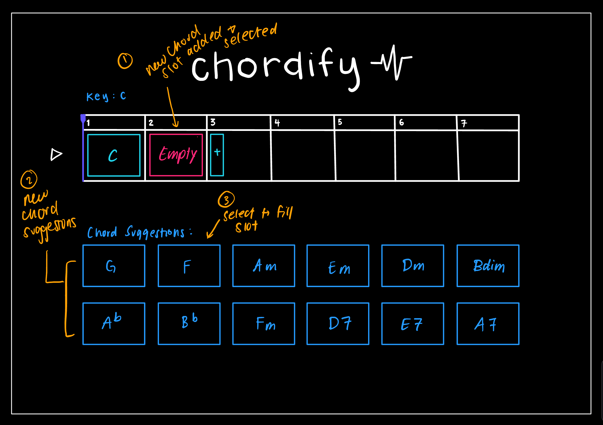

# Assignment 2: Functional Design
## Problem Statement
### Domain: Creating Music
I love to sing and make music. Songwriting is one of my favorite hobbies, along with singing and playing the piano and guitar. In my experience, some part of music making is hard to learn, and there can be many barriers to music making, such as knowledge, time, and money. I want to make the best music I can with the resources I have, but sometime I feel stuck with my songwriting and don't know where to start or continue a song.

### Problem: Difficulty creating chord progressions
There are many standard chord progressions in pop music, but I would like to get more creative than that, and also write in different genres. I find it hard to come up with novel chord progressions that sound good because I lack the experience and knowledge.

### Stakeholders:
1. Songwriters: users who want to create original songs but struggle to find chord progressions that sound good.
2. Music producers: often need unique progressions in produced music.
3. Music teachers: teachers who want to help students understand what different chord progressions sound like in a convenient way.

### Evidence
1. [Reddit r/Songwriting](https://www.reddit.com/r/Songwriting/comments/1lpn2dp/how_do_people_come_up_with_chord_progressions/): Various posts like this one asking for advice on how to create chord progressions, or what chords are interesting to listen to.
2. [Hooktheory](https://hooktheory.com/): A website that teaches music theory and chord progressions, showing that there is a demand for chord progressions learning tools.
3. [Youtube tutorials](https://www.youtube.com/watch?v=Vyc8lezaa9g): Many tutorials like this one with millions of views explaining chord progressions. Clearly there is a demand for musicians to learn chord progressions.
4. [ChordChord.com](https://chordchord.com/): A website that allows users to create chord progressions, evidence that users want software to speed up the chord progression finding process.
5. My Experience: I spend a lot of time trying to find good chord progressions, often to no avail. Sometimes I will find two chords that I like, but not know where to finish the progression. I also find it hard to learn all the new chords just to test them out.

## Application Pitch: Chordify
### Motivation
Finding good, novel chord progressions can be very difficult if you lack the knowledge, experience, or time to do so.
### Key Features
1. **Chord Suggestion**: Given the context of a chord (the key and what chords come before and/or after), a list of chords that sound good in the context are suggested. This gives the user a couple options to play with with creating their chord progression. The user will save time knowing that all these chords will sound good with the previous chords, and also doesn't require the user to know music theory.
2. **Playback**: Users can play the chord progression they created. This gives the users immediate feedback so that they can iterate more quickly on the chord progression, rather than learning the chords themselves and playing them on an instrument.
3. **Progression Building**: Users can add or delete chords to their chord progression. This gives the user flexibility to create the chord progression they want.

## Concept Design
### Concepts
```
concept BuildProgression

purpose
    enable users to construct and modify a sequence of musical units by adding, setting, or removing elements.

principle 
    A user begins with an empty sequence. They add new slots to extend the sequence, select a slot to edit, set a musical unit in that slot, and can later remove either the unit or the entire slot. At any time one slot is designated as selected for editing.

state
    a sequence of slots Slot, each slot with
        an optional musical unit Unit (empty or filled)
    a selectedSlot Slot, referencing one slot in the sequence or empty

actions
    selectSlot(slot):
        effect sets selectedSlot to the given slot

    addSlot():
        effect appends a new empty slot to the sequence and sets it as selectedSlot

    setUnit(unit):
        requires selectedSlot to not be empty
        effect sets the selectedSlot’s unit to unit

    deleteUnit():
        requires selectedSlot to not be empty
        effect removes the unit from selectedSlot (slot remains, now empty)

    deleteSlot():
        requires selectedSlot to not be empty
        effect removes selectedSlot from the sequence, sets selectedSlot to empty

    undoLastChange():
        effect restores the sequence to the state before the most recent modifying action
```
```
concept SuggestUnit

purpose 
    offer users suggestions for suitable musical units to place in any position of a sequence.

principle
    when a user selects a slot in a sequence, the system analyzes the context—the units before and after that slot— and generates a list of candidate units that would fit well in that position. If the sequence is empty, the system provides starting units. If the slot is at the end, the system suggests conappltinuations.

state
    a key Key
    a sequence of slots Slot, each slot with
        an optional musical unit Unit (empty or filled)

actions
    setKey(key):
        effect sets the key to key

    suggestUnit(slot):
        requires slot exists
        effect returns a list of suggested musical units to put in that position, taking into account the key and the units before and after it
```
```
concept Playback

purpose
    allow users to listen to sequences of musical units easily, enabling rapid feedbackand iteration during composition.

principle
    A user selects a sequence and chooses to play it back. The system plays each unit in order at the appropriate timing so the user can hear the progression. The user may also play an individual unit.

state
    a sequence of slots Slot, each slot with
        an optional musical unit Unit (empty or filled)

actions
    playUnit(unit):
        effect plays the unit once in real-time. If there is no unit, plays nothing.

    playSequence(sequence: list of Slots):
        requires sequence exists
        effect plays each slot's unit in order. If a slot is empty, plays nothing for that slot.
```
### Synchronizations
```
sync suggest
when BuildProgression.selectSlot(slot)
then SuggestChord.suggestUnit(slot)
```
```
sync play
when BuildProgression.setUnit(unit)
then Playback.playUnit(unit)
```

## UI Sketches
Figure 1  
 <br>
Figure 2  
 <br>
Figure 3  
 <br>
Figure 4  
 <br>
Figure 5  
 <br>
Figure 6  
 <br>

## User Journey
Angela is a budding songwriter who often struggles to come up with unique chord progressions. One afternoon, she sits down with a melody in mind but realizes that she has cycled through all the chords she knows and none feel inspiring. Frustrated, she opens Chordify on her laptop, hoping it can help spark new ideas. She selects the key to be C major, setting the tonal foundation for her song(Figure 1).

Next, Angela clicks the plus button to add her first chord slot (Figure 1). The app suggests a variety of chords compatible with C major (Figure 2), and she initially selects C major (Figure 3). She adds another slot, looks at the suggested options, and chooses F major (Figure 4). Curious how the sequence sounds, she clicks the play button to hear the progression (Figure 6). The combination of C and F feels too predictable, so she returns to the first slot, hits backspace, and swaps in A minor (Figure 5). She continues this process, adding slots, exploring suggestions, and listening as she goes. Through trial and error, Angela creates the sequence Am | F | C | G | Dm, enjoying the melodic flow but feeling that the G chord disrupts the progression’s mood.

She selects the G chord slot and deletes it with two presses of backspace, immediately updating the progression. She clicks play again and now hears Am | F | C | Dm, which perfectly captures the emotion she wants for her song. Satisfied, Angela is inspired to start building her full composition around this progression, confident that Chordify’s combination of suggestions, slot-based editing, and playback functionality allowed her to discover a progression she genuinely likes.
